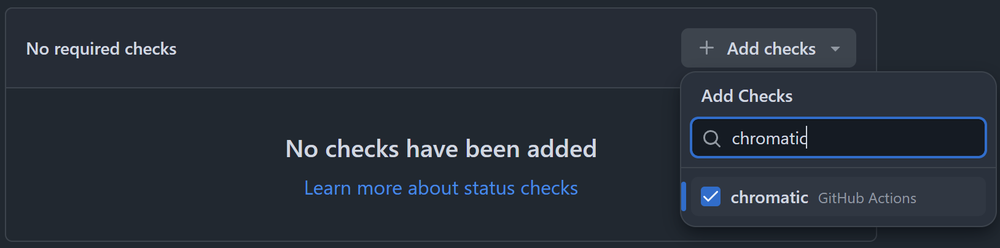

# Setup a Chromatic workflow with Turborepo

!!!tip
For simplicity, this workflow is not optimized for a [modular architecture](https://www.geeksforgeeks.org/system-design/what-is-a-modular-monolith/). However, we [recommend](./best-practices.md#use-a-modular-architecture) combining Chromatic with a modular architecture to improve performance and reduce costs. For an example, refer to this [proof of concept](https://github.com/patricklafrance/sg-next-architecture).
!!!

## Create the workflow file

To set up a [GitHub Actions](https://github.com/features/actions) Chromatic workflow for a [Turborepo](https://turborepo.com/) project, first, create a `chromatic.yml` file inside the `.github/workflows` folder at the root of the solution's workspace:

```bash !#4 .github/workflows/chromatic.yml
workspace
├── .github
├──── workflows
├────── chromatic.yml
├── package.json
```

Then, open the newly created file and copy/paste the following content:

```yaml !#5-16,29-30,33-37,42-44,46-49,67-75,77-83,85-95,97-103 .github/workflows/chromatic.yml
name: Chromatic

# PNPM setup based on https://github.com/pnpm/action-setup#use-cache-to-reduce-installation-time.

on:
  push:
    branches:
      - main
  pull_request:
    branches:
      - main
    types:
      - opened
      # To conditionally execute the workflow based on a PR label.
      - labeled
  workflow_dispatch:

env:
  CI: true

concurrency:
  group: chromatic-${{ github.ref }}
  cancel-in-progress: true

jobs:
  chromatic:
    runs-on: ubuntu-latest

    permissions:
      pull-requests: write

    steps:
      - name: Early exit if "run chromatic" label is not present
        if: github.event_name == 'pull_request' && !contains(github.event.pull_request.labels.*.name, 'run chromatic')
        run: |
          echo "No \"run chromatic\" label present. Skipping Chromatic workflow."
          exit 1

      - name: Checkout
        uses: actions/checkout@v6
        with:
          fetch-depth: 0
          # Refer to: https://www.chromatic.com/docs/github-actions/#recommended-configuration-for-build-events.
          ref: ${{ github.event.pull_request.head.ref }}
        env:
          # Refer to: https://www.chromatic.com/docs/github-actions/#recommended-configuration-for-build-events.
          CHROMATIC_BRANCH: ${{ github.event.pull_request.head.ref || github.ref_name }}
          CHROMATIC_SHA: ${{ github.event.pull_request.head.sha || github.ref }}
          CHROMATIC_SLUG: ${{ github.repository }}

      - name: Install pnpm
        uses: pnpm/action-setup@v4
        with:
          run_install: false

      - name: Install Node.js
        uses: actions/setup-node@v6
        with:
          node-version: '>=24.0.0'
          check-latest: true
          cache: pnpm
          cache-dependency-path: pnpm-lock.yaml

      - name: Install dependencies
        run: pnpm install --frozen-lockfile

      - name: Restore Turborepo cache
        id: cache-turborepo-restore
        uses: actions/cache/restore@v5
        with:
          key: ${{ runner.os }}-turbo-chromatic-${{ github.sha }}
          restore-keys: |
            ${{ runner.os }}-turbo-chromatic-
            ${{ runner.os }}-turbo-
          path: .turbo

      - name: Chromatic
        uses: chromaui/action@latest
        with:
          projectToken: ${{ secrets.CHROMATIC_PROJECT_TOKEN }}
          onlyChanged: true
          exitOnceUploaded: true
          autoAcceptChanges: main

      - name: Remove "run chromatic" label after Chromatic completion
        if: github.event_name == 'pull_request'
        uses: actions/github-script@v8
        with:
          script: |
            github.rest.issues.removeLabel({
                owner: context.repo.owner,
                repo: context.repo.repo,
                issue_number: context.issue.number,
                name: 'run chromatic'
            });

      - name: Save Turborepo cache
        id: cache-turborepo-save
        if: always() && steps.cache-turborepo-restore.outputs.cache-hit != 'true'
        uses: actions/cache/save@v5
        with:
          key: ${{ steps.cache-turborepo-restore.outputs.cache-primary-key }}
          path: .turbo
```

## Create a label

Next, since the workflow runs only when the `run chromatic` label is present on the pull request. Refer to the GitHub [documentation](https://docs.github.com/en/issues/using-labels-and-milestones-to-track-work/managing-labels#creating-a-label) to create a label named `run chromatic`.

## Add a required status check

Finally, because the workflow only runs when the run `chromatic label` is present on the pull request, it is important to make the Chromatic workflow a required status check. This ensures reviewers are reminded to run Chromatic before merging.

To do so, add a required status check for the `chromatic` job on the `default` branch [ruleset](https://docs.github.com/en/repositories/configuring-branches-and-merges-in-your-repository/managing-rulesets/about-rulesets):

:::align-image-left
{width=558}
:::

!!!tip
When adding a required status check, search for the **job name**, not the workflow name.
!!!

### Renovate bot and Changesets

If the repository uses [Renovate bot](https://github.com/renovatebot/renovate) or [Changesets](https://github.com/changesets/changesets) automation tools, consider excluding the branches they create from the `default` branch ruleset:

:::align-image-left
{width=558}
:::

## Try it :rocket:

To test your new CI workflow:

1. Create a pull request in GitHub and confirm that the Chromatic workflow **fails**.
2. Add a `run chromatic` label to the PR.
3. Confirm that the Chromatic workflow runs **successfully**.
