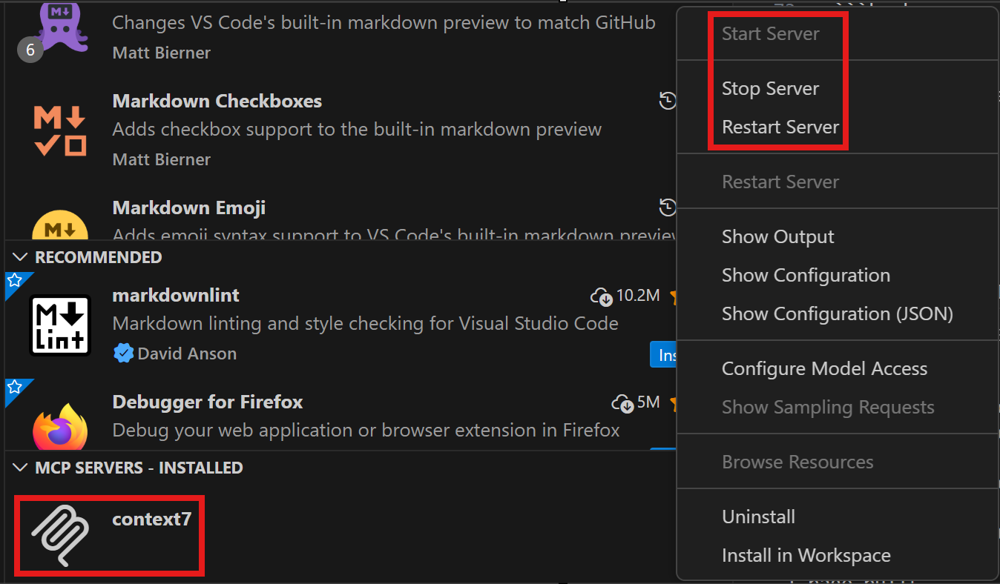

# Use with agents

Information about Web Configs libraries can be shared with different agents using [agent skills](https://skills.sh/) or the [Context7](https://context7.com/) MCP server.

## Install agent skills

Two skills are currently available:

| Name | Description |
| --- | --- |
| [workleap-web-configs](https://skills.sh/workleap/wl-web-configs/workleap-web-configs) | An agent skill that helps developers understand, set up, and customize Workleap's shared web tooling configurations. |
| [workleap-chromatic-best-practices](https://skills.sh/workleap/wl-web-configs/workleap-chromatic-best-practices) | An agent skill that guides developers on applying Workleap's documented Chromatic best practices. |

### Installation

Open a terminal and install the agent skills by running the following commands:

+++ workleap-web-configs
```bash
npx skills add https://github.com/workleap/wl-web-configs --skill workleap-web-configs
```
+++ workleap-chromatic-best-practices
```bash
npx skills add https://github.com/workleap/wl-web-configs --skill workleap-chromatic-best-practices
```
+++

!!!tip
At installation, the `skills.sh` CLI will prompt you to choose whether to install the skill globally or within a project. We recommend installing it **locally** so it is available for code review tools such as [Claude Code code review](https://github.com/anthropics/claude-code-action).
!!!

### Try it :rocket:


Once the skills are installed, start an agent and ask it to set up a new project or audit an existing Chromatic setup:

```
I'm creating a new React + TypeScript web application from scratch. Set up the project to use Workleap shared configs for ESLint, TypeScript and Rsbuild.
```

```
Audit the Chromatic setup in my project and propose improvements based on Workleap's Chromatic best practices.
```

## Setup Context7 MCP server

Context7 is an MCP server that provides AI assistants with real-time, version-specific programming documentation and code examples. Instead of relying only on a model's training data, it allows AI tools to fetch up-to-date information directly from authoritative sources (such as the code repository or the official documentation) at request time. This helps reduce hallucinations and errors caused by outdated APIs, especially in coding environments such as IDEs or editor integrations.

### VS Code

For a quick setup, install the Context7 MCP server directly from the VS Code Marketplace:

[](https://insiders.vscode.dev/redirect?url=vscode%3Amcp%2Finstall%3F%7B%22name%22%3A%22context7%22%2C%22command%22%3A%22npx%22%2C%22args%22%3A%5B%22-y%22%2C%22%40upstash%2Fcontext7-mcp%40latest%22%5D%7D)&nbsp;&nbsp;&nbsp;[](https://insiders.vscode.dev/redirect?url=vscode-insiders%3Amcp%2Finstall%3F%7B%22name%22%3A%22context7%22%2C%22command%22%3A%22npx%22%2C%22args%22%3A%5B%22-y%22%2C%22%40upstash%2Fcontext7-mcp%40latest%22%5D%7D)

#### Configuration file

Alternatively, you can configure the MCP server manually by updating the VS Code [MCP configuration file](https://code.visualstudio.com/docs/copilot/customization/mcp-servers):

+++ Remote server connection
```json
"mcp": {
    "servers": {
        "context7": {
            "type": "http",
            "url": "https://mcp.context7.com/mcp",
            "headers": {
                "CONTEXT7_API_KEY": "YOUR_OPTIONAL_API_KEY"
            }
        }
    }
}
```
+++ Local server connection
```json
"mcp": {
    "servers": {
        "context7": {
            "type": "stdio",
            "command": "npx",
            "args": ["-y", "@upstash/context7-mcp", "--api-key", "YOUR_OPTIONAL_API_KEY"]
        }
    }
}
```
+++

!!!tip
For more details about supported clients and configurations, refer to the Context7 [clients documentation](https://context7.com/docs/resources/all-clients).
!!!

#### Verify the connection

Open the Extensions view in VS Code and locate the `context7` MCP server. Click the gear icon to access its settings and confirm that the server is running:

:::align-image-left
{width=449}
:::

### Claude Code

To install Context7 with Claude Code, open a terminal and execute one of the following commands:

+++ Remote server connection
```bash
claude mcp add --header "CONTEXT7_API_KEY: YOUR_OPTIONAL_API_KEY" --transport http context7 https://mcp.context7.com/mcp
```
+++ Local server connection
```bash
claude mcp add context7 -- pnpmx -y @upstash/context7-mcp --api-key YOUR_OPTIONAL_API_KEY
```
+++

!!!tip
For more details and alternative installation options, refer to the Context7 [Claude Code documentation](https://context7.com/docs/clients/claude-code).
!!!

#### Verify the connection

Open Claude Code and execute the `/mcp` command:

:::align-image-left
{width=422}
:::

Then, select the `Context7 MCP server` to view its details, including connection status, authentication, and available tools:

:::align-image-left
{width=636}
:::

Alternatively, you can verify the connection from a terminal by executing the `claude mcp list` command. The `context7` MCP server should be listed as **connected**.

### Try it :rocket:

Once the MCP server is set up, ask the agent to use Context7 to perform tasks such as generating boilerplate code:

```
I'm creating a new React + TypeScript web application from scratch. Use context7 "/workleap/wl-web-configs" library to set up the project to use Workleap shared configs for ESLint, TypeScript and Rsbuild.
```
